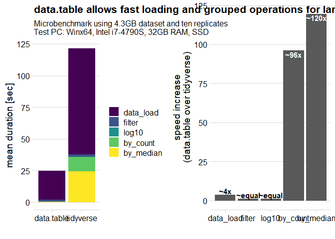

B001: reasons for DT
================
Alexander Hogrebe
Current version 06 February, 2022; First version 2022-01-29

# Load libraries and functions

``` r
#load functions and render local functions copy
library(tidyverse)
library(data.table)
library(microbenchmark)
library(ggplot2)
library(cowplot)

#folder path (enter with snippet pp)
path <- "B001_data_load/"
```

# Timings DT vs Tidyverse

In this comparison, a data.table and the tidyverse are both loading the
same data set, filter based on a numeric column, calculating log10
intensities, count items in groups and calculate the median of a numeric
column in groups. Results are plotted with seconds per task.

``` r
#timing list
times <- list()

#load data
times[[1]] <- as.data.table(summary(microbenchmark(
  data.table = data_dt <- fread(paste0(path, "data/diann_pY.tsv")),
  tidyverse = data_tv <- read_tsv(paste0(path, "data/diann_pY.tsv")),
  times = 10, unit = "seconds"
)))[, step := "data_load"]
```

    ## Rows: 5637683 Columns: 61

    ## -- Column specification --------------------------------------------------------
    ## Delimiter: "\t"
    ## chr (10): File.Name, Run, Protein.Group, Protein.Ids, Modified.Sequence, Str...
    ## dbl (45): PG.Quantity, PG.Normalised, PG.MaxLFQ, Precursor.Charge, Q.Value, ...
    ## lgl  (6): Protein.Names, Genes, Genes.Quantity, Genes.Normalised, Genes.MaxL...

    ## 
    ## i Use `spec()` to retrieve the full column specification for this data.
    ## i Specify the column types or set `show_col_types = FALSE` to quiet this message.

    ## Rows: 5637683 Columns: 61

    ## -- Column specification --------------------------------------------------------
    ## Delimiter: "\t"
    ## chr (10): File.Name, Run, Protein.Group, Protein.Ids, Modified.Sequence, Str...
    ## dbl (45): PG.Quantity, PG.Normalised, PG.MaxLFQ, Precursor.Charge, Q.Value, ...
    ## lgl  (6): Protein.Names, Genes, Genes.Quantity, Genes.Normalised, Genes.MaxL...

    ## 
    ## i Use `spec()` to retrieve the full column specification for this data.
    ## i Specify the column types or set `show_col_types = FALSE` to quiet this message.

    ## Rows: 5637683 Columns: 61

    ## -- Column specification --------------------------------------------------------
    ## Delimiter: "\t"
    ## chr (10): File.Name, Run, Protein.Group, Protein.Ids, Modified.Sequence, Str...
    ## dbl (45): PG.Quantity, PG.Normalised, PG.MaxLFQ, Precursor.Charge, Q.Value, ...
    ## lgl  (6): Protein.Names, Genes, Genes.Quantity, Genes.Normalised, Genes.MaxL...

    ## 
    ## i Use `spec()` to retrieve the full column specification for this data.
    ## i Specify the column types or set `show_col_types = FALSE` to quiet this message.

    ## Rows: 5637683 Columns: 61

    ## -- Column specification --------------------------------------------------------
    ## Delimiter: "\t"
    ## chr (10): File.Name, Run, Protein.Group, Protein.Ids, Modified.Sequence, Str...
    ## dbl (45): PG.Quantity, PG.Normalised, PG.MaxLFQ, Precursor.Charge, Q.Value, ...
    ## lgl  (6): Protein.Names, Genes, Genes.Quantity, Genes.Normalised, Genes.MaxL...

    ## 
    ## i Use `spec()` to retrieve the full column specification for this data.
    ## i Specify the column types or set `show_col_types = FALSE` to quiet this message.

    ## Rows: 5637683 Columns: 61

    ## -- Column specification --------------------------------------------------------
    ## Delimiter: "\t"
    ## chr (10): File.Name, Run, Protein.Group, Protein.Ids, Modified.Sequence, Str...
    ## dbl (45): PG.Quantity, PG.Normalised, PG.MaxLFQ, Precursor.Charge, Q.Value, ...
    ## lgl  (6): Protein.Names, Genes, Genes.Quantity, Genes.Normalised, Genes.MaxL...

    ## 
    ## i Use `spec()` to retrieve the full column specification for this data.
    ## i Specify the column types or set `show_col_types = FALSE` to quiet this message.

    ## Rows: 5637683 Columns: 61

    ## -- Column specification --------------------------------------------------------
    ## Delimiter: "\t"
    ## chr (10): File.Name, Run, Protein.Group, Protein.Ids, Modified.Sequence, Str...
    ## dbl (45): PG.Quantity, PG.Normalised, PG.MaxLFQ, Precursor.Charge, Q.Value, ...
    ## lgl  (6): Protein.Names, Genes, Genes.Quantity, Genes.Normalised, Genes.MaxL...

    ## 
    ## i Use `spec()` to retrieve the full column specification for this data.
    ## i Specify the column types or set `show_col_types = FALSE` to quiet this message.

    ## Rows: 5637683 Columns: 61

    ## -- Column specification --------------------------------------------------------
    ## Delimiter: "\t"
    ## chr (10): File.Name, Run, Protein.Group, Protein.Ids, Modified.Sequence, Str...
    ## dbl (45): PG.Quantity, PG.Normalised, PG.MaxLFQ, Precursor.Charge, Q.Value, ...
    ## lgl  (6): Protein.Names, Genes, Genes.Quantity, Genes.Normalised, Genes.MaxL...

    ## 
    ## i Use `spec()` to retrieve the full column specification for this data.
    ## i Specify the column types or set `show_col_types = FALSE` to quiet this message.

    ## Rows: 5637683 Columns: 61

    ## -- Column specification --------------------------------------------------------
    ## Delimiter: "\t"
    ## chr (10): File.Name, Run, Protein.Group, Protein.Ids, Modified.Sequence, Str...
    ## dbl (45): PG.Quantity, PG.Normalised, PG.MaxLFQ, Precursor.Charge, Q.Value, ...
    ## lgl  (6): Protein.Names, Genes, Genes.Quantity, Genes.Normalised, Genes.MaxL...

    ## 
    ## i Use `spec()` to retrieve the full column specification for this data.
    ## i Specify the column types or set `show_col_types = FALSE` to quiet this message.

    ## Rows: 5637683 Columns: 61

    ## -- Column specification --------------------------------------------------------
    ## Delimiter: "\t"
    ## chr (10): File.Name, Run, Protein.Group, Protein.Ids, Modified.Sequence, Str...
    ## dbl (45): PG.Quantity, PG.Normalised, PG.MaxLFQ, Precursor.Charge, Q.Value, ...
    ## lgl  (6): Protein.Names, Genes, Genes.Quantity, Genes.Normalised, Genes.MaxL...

    ## 
    ## i Use `spec()` to retrieve the full column specification for this data.
    ## i Specify the column types or set `show_col_types = FALSE` to quiet this message.

    ## Rows: 5637683 Columns: 61

    ## -- Column specification --------------------------------------------------------
    ## Delimiter: "\t"
    ## chr (10): File.Name, Run, Protein.Group, Protein.Ids, Modified.Sequence, Str...
    ## dbl (45): PG.Quantity, PG.Normalised, PG.MaxLFQ, Precursor.Charge, Q.Value, ...
    ## lgl  (6): Protein.Names, Genes, Genes.Quantity, Genes.Normalised, Genes.MaxL...

    ## 
    ## i Use `spec()` to retrieve the full column specification for this data.
    ## i Specify the column types or set `show_col_types = FALSE` to quiet this message.

``` r
#filter global q value
times[[2]] <- as.data.table(summary(microbenchmark(
  data.table = data_dt_q <- data_dt[Global.Q.Value<0.01],
  tidyverse = data_tv_q <- filter(data_tv, Global.Q.Value<0.01),
  times = 10, unit = "seconds"
)))[, step := "filter"]

rm(data_dt, data_tv)

#calculate log10 intensities
times[[3]] <- as.data.table(summary(microbenchmark(
  data.table = data_dt_q[, log10.Precursor.Quantity := log10(Precursor.Quantity)],
  tidyverse = data_tv_q <- mutate(data_tv_q, log10.Precursor.Quantity = log10(Precursor.Quantity)),
  times = 10, unit = "seconds"
)))[, step := "log10"]

#define number of peptides per protein
times[[4]] <- as.data.table(summary(microbenchmark(
  data.table = data_dt_q[, .N, by=c("Run", "Protein.Group")],
  tidyverse = data_tv_q %>% count(Run, Protein.Group),
  times = 10, unit = "seconds"
)))[, step := "by_count"]

#median intensities per protein
times[[5]] <- as.data.table(summary(microbenchmark(
  data.table = data_dt_q[, .(Protein.Quantity = median(log10.Precursor.Quantity, na.rm=T)), by=c("Run", "Protein.Group")],
  tidyverse = data_tv_q %>% group_by(Run, Protein.Group) %>% summarise(Protein.Quantity = median(log10.Precursor.Quantity, na.rm=T)),
  times = 10, unit = "seconds"
)))[, step := "by_median"]
```

    ## `summarise()` has grouped output by 'Run'. You can override using the `.groups` argument.

    ## `summarise()` has grouped output by 'Run'. You can override using the `.groups` argument.
    ## `summarise()` has grouped output by 'Run'. You can override using the `.groups` argument.
    ## `summarise()` has grouped output by 'Run'. You can override using the `.groups` argument.
    ## `summarise()` has grouped output by 'Run'. You can override using the `.groups` argument.
    ## `summarise()` has grouped output by 'Run'. You can override using the `.groups` argument.
    ## `summarise()` has grouped output by 'Run'. You can override using the `.groups` argument.
    ## `summarise()` has grouped output by 'Run'. You can override using the `.groups` argument.
    ## `summarise()` has grouped output by 'Run'. You can override using the `.groups` argument.
    ## `summarise()` has grouped output by 'Run'. You can override using the `.groups` argument.

``` r
#assemble results data.table
times <- rbindlist(times)
times[, expr := factor(expr, levels = c("data.table", "tidyverse"))]
times[, step := factor(step, levels = c("data_load", "filter", "log10", "by_count", "by_median"))]

saveRDS(times, paste0(path, "export/times.rds"))
#times <- readRDS(paste0(path, "export/times.rds"))

p_times <- ggplot(times, aes(x=expr, y=mean, fill=step)) +
  geom_bar(stat = "identity") + xlab("") + ylab("mean duration [sec]") +
  ggtitle("data.table allows fast loading and grouped operations for large data",
          subtitle = "Microbenchmark using 4.3GB dataset and ten replicates\nTest PC: Winx64, Intel i7-4790S, 32GB RAM, SSD") +
  scale_fill_viridis_d("") + theme_minimal_hgrid()

times_rel <- times[, .(mean_rel = mean[2]/mean[1]), by = c("step")]
times_rel[, lab := paste0("~", round(mean_rel, 0), "x")]
times_rel[mean_rel<1.4, lab := "~equal"]

p_times_rel <- ggplot(times_rel, aes(x=step, y=mean_rel, label=lab)) +
  geom_bar(stat = "identity") +
  geom_text(y=times_rel$mean_rel+c(rep(2.5, 3), rep(-2.5, 2)), color=c(rep("black", 3), rep("white", 2)), fontface = "bold") +
  xlab("") + ylab("speed increase\n(data.table over tidyverse)") +
  theme_minimal_hgrid()

plot_grid(p_times, p_times_rel)
```

<!-- -->

``` r
ggsave2(paste0(path, "figures/DT-vs-TV_speed-increase.pdf"), width = 10, height = 5)
```

## References

References for timing (and command) comparisons of DT vs tidyverse:

<https://wetlandscapes.com/blog/a-comparison-of-r-dialects/> (comparison
of syntax only)
<https://stackoverflow.com/questions/21435339/data-table-vs-dplyr-can-one-do-something-well-the-other-cant-or-does-poorly>
<https://github.com/Rdatatable/data.table/wiki/Benchmarks-%3A-Grouping>
<https://h2oai.github.io/db-benchmark/>
<https://opremic.com/benchmarking-the-six-most-used-manipulations-for-data-tables-in-r/>
