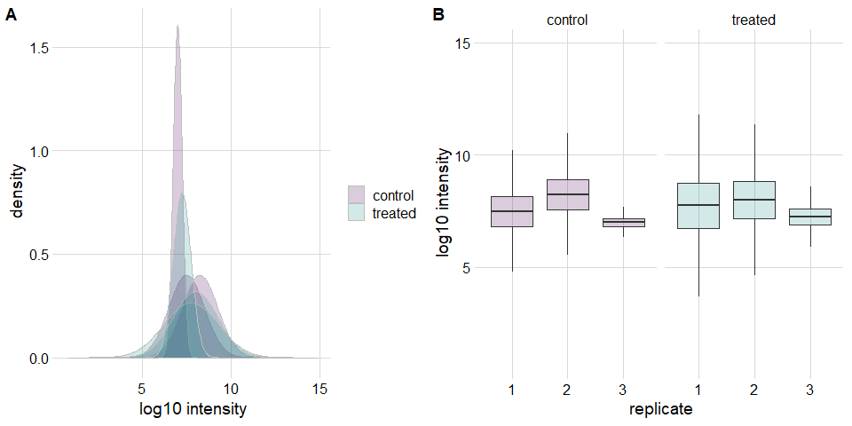

B002: Normalization
================
Alexander Hogrebe
Current version 24 March, 2022; First version 2022-03-18

# Load libraries and functions

``` r
#load functions and render local functions copy
library(tidyverse)
library(data.table)
library(ggplot2)
library(viridis)
library(cowplot)

#folder path (enter with snippet pp)
path <- "B002_normalization/"

#combine two strings
string_combine <- function(string_list, link = "_", string_priority=c("first", "last")) {
  if(!is.list(string_list)) stop("'string_list' must be a list of vectors")
  string_priority <- match.arg(string_priority)
  
  if(string_priority=="first") {
    apply(expand.grid(rev(string_list))[, length(string_list):1], 1, paste, collapse=link)
  } else {
    apply(expand.grid(string_list), 1, paste, collapse=link)
  }
}
```

# Generating (non-tidy) random data.table

To illustrate the importance of data normalization, we will first
generate a data table containing two conditions with three replicates
each. After log transformation, MS-based intensity data is roughly
normal distributed, so we will generate it using R’s rnorm function.

``` r
#define samples, conditions and color schemes
sample_val <- string_combine(list(c("control", "treated"), 1:3))

cond_val <- unique(gsub("^(.*)_.$", "\\1", sample_val))
cond_col <- viridis(3)[1:2]
names(cond_col) <- cond_val


#generate data.table (dt) with 6 emulated log10 intensity distributions, differing in mean and sd
n_rows <- 1e6

#option 1) traditional way
set.seed(123)
dt <- data.table(control_1 = rnorm(n_rows, 7.5, 1),
                 control_2 = rnorm(n_rows, 8.25, 1),
                 control_3 = rnorm(n_rows, 7, 0.25),
                 treated_1 = rnorm(n_rows, 7.75, 1.5),
                 treated_2 = rnorm(n_rows, 8, 1.25),
                 treated_3 = rnorm(n_rows, 7.25, 0.5))

#option 2) rename dt columns with sample name string
set.seed(123)
dt <- data.table(rnorm(n_rows, 7.5, 1),
                 rnorm(n_rows, 8.25, 1),
                 rnorm(n_rows, 7, 0.25),
                 rnorm(n_rows, 7.75, 1.5),
                 rnorm(n_rows, 8, 1.25),
                 rnorm(n_rows, 7.25, 0.5))
#rename columns BY REFERENCE
setnames(dt, sample_val)

#define peptide_ID column BY REFERENCE
dt[, peptide_ID := 1:.N]

#set key for dt, which will sort dt by peptide_ID
setkey(dt, peptide_ID)
key(dt)
```

    ## [1] "peptide_ID"

# Transform into tidy data.table

``` r
#perform wide to long format transformation using melt
dt <- melt(dt, measure.vars = sample_val, variable.name = "sample", value.name = "intensity")
setkey(dt, peptide_ID, sample)
key(dt)
```

    ## [1] "peptide_ID" "sample"

``` r
#assign condition and replicate columns by reference
dt[, condition := gsub("^(.*)_.$", "\\1", sample)]
dt[, replicate := gsub("^.*_(.)$", "\\1", sample)]

#plot intensity distributions as density and boxplots
p_density <- ggplot(dt, aes(x=intensity, group=sample, fill=condition)) +
  geom_density(alpha = 0.2, color = "grey") + xlab("log10 intensity") +
  scale_fill_manual("", values = cond_col) + theme_minimal_grid()

p_boxplot <- ggplot(dt, aes(y=intensity, x=replicate, fill=condition)) +
  geom_boxplot(alpha = 0.2, outlier.shape = NA) + ylab("log10 intensity") + facet_wrap(~condition) +
  scale_fill_manual("", values = cond_col) + theme_minimal_grid() + theme(legend.position = "none")
```

``` r
plot_grid(p_density, p_boxplot, labels = "AUTO")
```

<!-- -->

``` r
ggsave2(paste0(path, "figures/intensity_distributions.pdf"), width = 10, height = 5)
```
